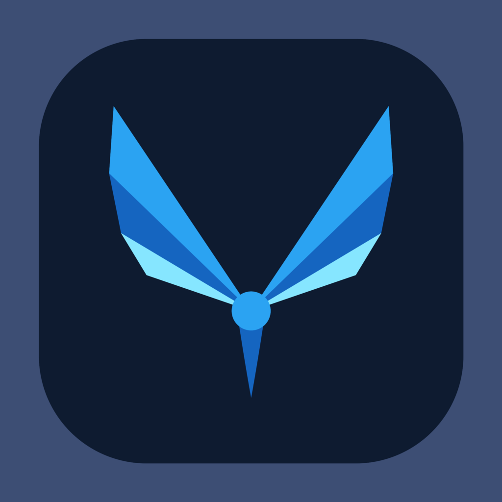

<p align="center">
  
</p>

<h1 align="center">flutterwatch</h1>

<p align="center">
  <b>Build Flutter apps for Apple&nbsp;Watch.</b><br/>
  A drop-in CLI companion to the Flutter SDK — same commands, same hot reload,
  same DevTools — targeting <b>watchOS</b> instead of iOS.
</p>

<p align="center">
  <a href="https://flutterwatch.dev"><b>Website</b></a> &nbsp;·&nbsp;
  <a href="https://github.com/flutterwatch/flutter-watchos/blob/main/doc/get-started.md">Get started</a> &nbsp;·&nbsp;
  <a href="https://github.com/flutterwatch/flutter-watchos/blob/main/doc/commands.md">Commands</a> &nbsp;·&nbsp;
  <a href="https://pub.dev/publishers/flutterwatch.dev/packages">Plugins on pub.dev</a> &nbsp;·&nbsp;
  <a href="https://api.flutterwatch.dev/">Sign in</a>
</p>

<p align="center">
  
  
  
  
</p>

---

### What is flutterwatch?

flutterwatch brings the Flutter framework to **Apple Watch**. Write your app in
Dart with the widgets and packages you already use, run it on the watchOS
Simulator with hot reload or on a paired Apple Watch, inspect it with DevTools
exactly like Flutter for iOS or Android, and ship it to the App Store.

It is a standalone CLI that wraps an unmodified Flutter SDK and a pre-built
watchOS engine, so there's no custom Flutter checkout to maintain. watchOS is a
first-class platform at both build and runtime, which keeps plugins and
cross-platform apps clean.

### Highlights

- 🛠️ **A drop-in CLI** — the `flutter` commands you know (`create`, `run`, `build`, `doctor`), retargeted to watchOS.
- ⚡ **Hot reload & DevTools** — the same inner loop, on the watchOS Simulator.
- ⌚ **Real Apple Watch** — run on a paired watch in profile or release, and build for the App Store.
- 🧩 **Plugins, already ported** — storage, sensors, location, video, audio and Firebase, on pub.dev.

### Get started

```sh
# 1. install the toolchain
git clone https://github.com/flutterwatch/flutter-watchos.git
cd flutter-watchos && export PATH="$PATH:$PWD/bin"

# 2. fetch the engine
flutter-watchos precache && flutter-watchos doctor

# 3. build your first watch app, on the Simulator
flutter-watchos create hello_watch
cd hello_watch && flutter-watchos run

# 4. a real watch and the App Store: sign in, get the rest
flutter-watchos login && flutter-watchos precache
```

The Simulator needs no account. To run on a watch you own and to build for the
App Store, sign in with GitHub — at **[api.flutterwatch.dev](https://api.flutterwatch.dev/)**
or with `flutter-watchos login`. That is all an account takes.

### Repositories

| Repository | What it is |
| --- | --- |
| [**flutter-watchos**](https://github.com/flutterwatch/flutter-watchos) | The CLI, templates, and documentation. |
| [plugins](https://github.com/flutterwatch/plugins) | watchOS implementations of popular Flutter plugins, published on pub.dev under [flutterwatch.dev](https://pub.dev/publishers/flutterwatch.dev/packages). |
| [flutter_watchos](https://pub.dev/packages/flutter_watchos) | First-party package — platform detection, device info, haptics, and the Digital Crown. |

<br/>

<p align="center"><sub>
  Not affiliated with or endorsed by Google or Apple. Flutter is a trademark of
  Google&nbsp;LLC; Apple&nbsp;Watch and watchOS are trademarks of Apple&nbsp;Inc.
</sub></p>
